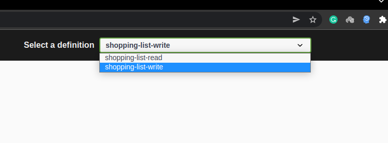
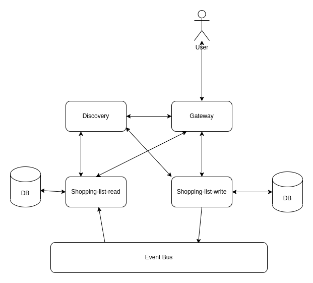
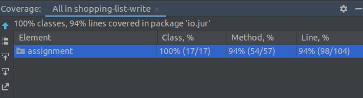
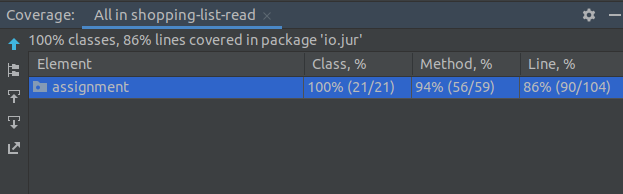

# User Shopping List Microservice
## Tools and Frameworks
- Java 17
- Maven
- Spring boot
- Spring cloud (Spring API Gateway and Eureka Discovery Server)
- Junit Test Cases
- TestContainer
- Docker
- Docker compose
- Liquibase
- Redis (as Event Bus)
- Postgres DB

## Prerequisites

#### Java Version 17
#### Maven 3.8.1
#### Docker 20.10.12
#### Docker compose 1.29.2

## How to run
To run with just docker:
```shell
docker-compose up --build
```
**It takes considerable amount of time to build :-). drink a coffee during build.**
<br/>
<br/>
**If you have java installed in your system you can run all microservices with more speed using:** 
```shell
./run.sh
```
<br/>
It would create 6 microservices including: 

```shell
redis
postgres
discovery (eureka)
gateway (spring gateway)
shopplin-list-read
shopping-list-write
```
The application default port is 8080, and after running successfully (it takes 
time all microservices get ready) ,
you can find the swagger address at http://localhost:8080/swagger-ui.html
<p></p>
There is two separate swagger from two microservices which can be chosen from 
drop down list:



1. **shopping-list-read**: Microservice to create and delete user shopping list.
2. **shopping-list-write**: Microservice to query user shopping list.

## Architecture
This is trivial version of **CQRS** pattern. The **shopping-list-write** persist **ADD** and 
**REMOVE** event into database using **event sourcing** pattern. These events emitted into 
event bus (I used Redis as event bus because of ease of use but Kafka or RabbitMQ would be 
my choice in real world). The **shopping-list-reader** reads ADD and REMOVE events and update 
its local database. 



## Scalability 
All components of this architecture are horizontally scalable. Because we separate read and write
part of service, we can optimize databases based on their application. For example using fast write 
database for write microservice and using fast read database for read microservice. 

## Test
There are two kind of tests. Integration using TestContainer and Unit tests.
<br/>
This is the code coverage of read and write microservices: 



## DB Schema Management
To manage DB schema I used [liquibase](https://liquibase.org/).
## Inter-Microservice Communication Schema Management
For inter-microservice communication, I used a common module between read and write 
microservice, but it is hard to maintain and scale, so for real world I suggest 
schema registry tools like 
[Red Hat Service Registry](https://access.redhat.com/documentation/en-us/red_hat_amq/7.6/html/using_amq_streams_on_openshift/service-registry-str) 
or [Apicurio Registry](https://www.apicur.io/registry/).
## Code Statistics Analysis
Usually I use SonarCube, but I did not do it for this project because lack of time.
## Todos
- **Exception handling:** For API and inter-microservice communication
- **Eventual consistency assurance:** In a case of inconsistency (for example network outage)
, a mechanism have to be responsible to resolve inconsistencies. 

